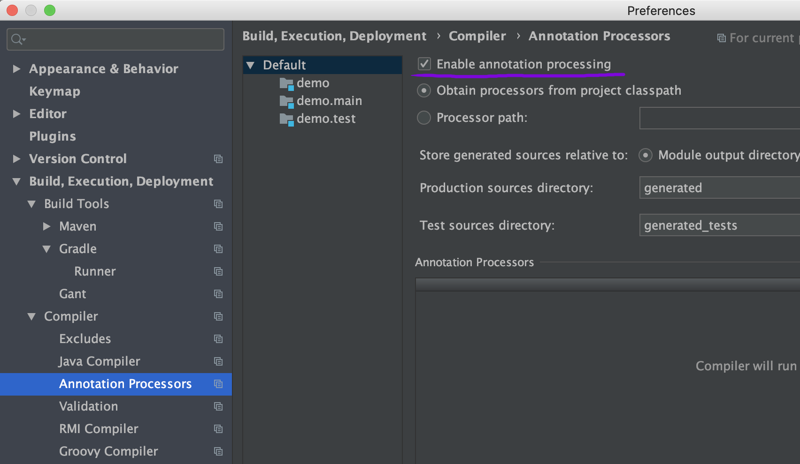
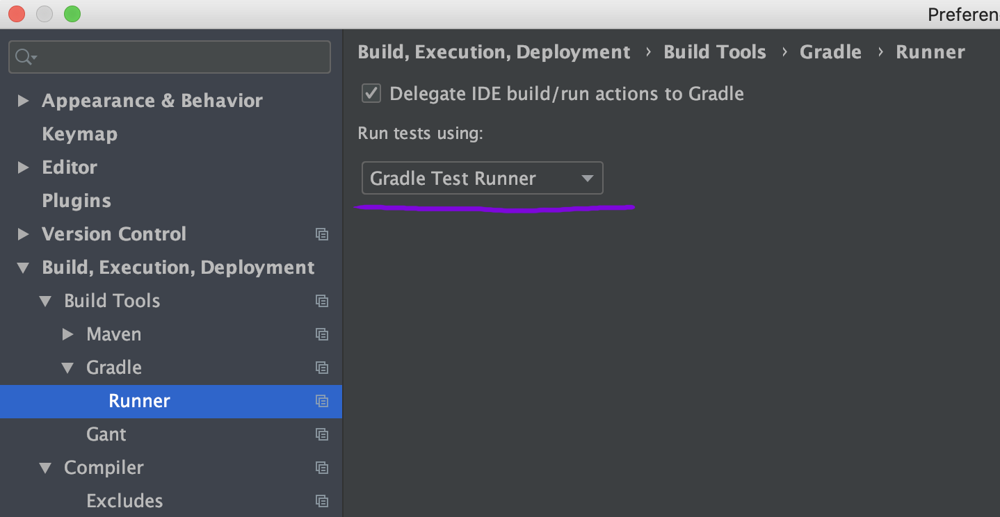

:sectnums:

# Better Strings - Java String Interpolation

image:https://travis-ci.com/antkorwin/better-strings.svg?branch=master["Build Status",link="https://travis-ci.com/antkorwin/better-strings"]
image:https://codecov.io/gh/antkorwin/better-strings/branch/master/graph/badge.svg[link ="https://codecov.io/gh/antkorwin/better-strings"]
image:https://maven-badges.herokuapp.com/maven-central/com.antkorwin/better-strings/badge.svg[link="https://search.maven.org/search?q=g:com.antkorwin%20AND%20a:better-strings"]

The Java Plugin to use string interpolation for Java (like in Kotlin).
Supports Java 8, 9, 10, 11, ...

## Motivation

In the latest JEPs https://openjdk.java.net/jeps/355, we have the only expectation of the RAW string literals, but there is nothing about the string interpolation.

And it’s so sad, that we need writing code like this in the 2020 year:

[source,java]
----
int a = 3;
int b = 4;
System.out.println(a + " + " + b + " = " + (a + b));
----

just to print the string: `3 + 4 = 7`

of course, we can use a `var` since Java 10:

[source,java]
----
var a = 3;
var b = 4;
System.out.println(a + " + " + b + " = " + (a + b));
----

But this code is still sad =(

## What can we do with the Better Strings plugin?

### Using variables in string literals

[source,java]
----
var a = 3;
var b = 4;
System.out.println("${a} + ${b} = ${a+b}");
----

prints:  `3 + 4 = 7`

### Using expressions

[source,java]
----
var a = 3;
var b = 4;
System.out.println("flag = ${a > b ? true : false}");
----

prints:  `flag = false`

[source,java]
----
var a = 3;
System.out.println("pow = ${a * a}");
----

prints:  `pow = 9`

### Using functions

[source,java]
----
@Test
void functionCall() {
    System.out.println("fact(5) = ${factorial(5)}");
}

long factorial(int n) {
    long fact = 1;
    for (int i = 2; i <= n; i++) {
        fact = fact * i;
    }
    return fact;
}
----

prints:  `fact(5) = 120`

### Using string interpolation in class fields

you can use better-string for string interpolation in class fields, for example:

[source,java]
----
public class Test {
	public String field = "${3+4}";
	public String getField(){
		return "field = ${field}";
	}
}
----

`new Test().getField()` prints : `field = 7`

### Using string interpolation in default methods of interfaces

also you can use string interpolation with default methods in interfaces like this:

[source,java]
----
public interface InterfaceWithDefaultMethod {
	default String sum(){
		return "sum = ${1+2}";
	}
}

public class Test implements InterfaceWithDefaultMethod {
	public String test() {
		return sum();
	}
}
----

The result of  `new Test().test()` is  `sum = 3`

### Using string interpolation in enums

In addition you can use string interpolation for code of enums:

[source, java]
----
public enum EnumCode {
	FIRST,
	SECOND,
	THIRD;

	@Override
	public String toString() {
		return "value: ${this.name()}, order: ${this.ordinal() + 1}";
	}
}
----

`EnumCode.THIRD.toString();` should print: `value: THIRD, order: 3`

### Limitations

It's impossible to use the string interpolation within annotations value.
It provides compatibility with spring framework properties injecting by the `@Value` annotation.

### Disclaimer

NOTE: Keep in mind that this feature should be used carefully.
You shouldn't write too much code inside string literals because it is too difficult to maintain and maybe not obvious for debugging.

## Getting started

### Maven

You need to add the following dependency:

[source,xml]
----
<dependency>
    <groupId>com.antkorwin</groupId>
    <artifactId>better-strings</artifactId>
    <version>0.5</version>
</dependency>
----

And you can use string interpolation anywhere in your code.

NOTE: if you use `maven-compiler-plugin` in your pom file then declare `better-string`
in the annotation processors configuration section:

[source, xml]
----
<plugin>
    <groupId>org.apache.maven.plugins</groupId>
    <artifactId>maven-compiler-plugin</artifactId>
    <version>3.5.1</version>
    <configuration>
        <annotationProcessorPaths>
            <path>
               <groupId>com.antkorwin</groupId>
               <artifactId>better-strings</artifactId>
               <version>${better-strings.version}</version>
            </path>
        </annotationProcessorPaths>
    </configuration>
</plugin>
----

You can read more about configuration of multiple annotation processors
for one project https://github.com/antkorwin/better-strings#6-how-to-use-with-other-annotation-processors[here].

### Gradle

Add the following dependencies in your `build.gradle` file:

[source, gradle]
----
compileOnly 'com.antkorwin:better-strings:0.4'
annotationProcessor 'com.antkorwin:better-strings:0.4'
----

if you want use string interpolation for tests:

[source]
----
testCompileOnly 'com.antkorwin:better-strings:0.4'
testAnnotationProcessor 'com.antkorwin:better-strings:0.4'
----

Example of a simple application with gradle build:
https://github.com/antkorwin/better-strings-demo

### Intellij IDEA

Sometimes you can get into problems with gradle projects in IDEA,
an internal runner(in IDEA) may not execute our annotation processor.

You can read more about this problem here: https://stackoverflow.com/a/55605950

I suggest to turn on `enable annotation processing`

And select the `gradle test runner` in the Intellij IDEA settings.

### Eclipse

Unfortunately, better-string doesn't work with Eclipse.
Eclipse uses its own java compiler and the annotation processing
with AST modification isn't work with them out of the box.

## How to turn-off string interpolation

To skip the string interpolation for class, method or field you can use the `@DisabledStringInterpolation` annotation:

[source,java]
----
@DisabledStringInterpolation
class Foo {
    void test() {
        System.out.println("${a+b}");
    }
}
----

this code prints: `${a+b}`

Also, you can use the following workaround to escape string interpolation locally in your code:

[source,java]
----
System.out.println("${'$'}{a+b}");
----

the result is : `${a+b}`

## How to control the generated code

Better Strings is a Java Annotation Processor, but it does not process specific annotations, it makes AST modification of your code while javac compiling it.

By default, each `${...}` occurrence translates into an invocation of `String#valueOf`.
For instance, a string:

[source,java]
----
"Result: ${obj}.method() = ${obj.method()}"
----

will yield:

[source,java]
----
"Result: "
  + String.valueOf(obj)
  + ".method() = "
  + String.valueOf(obj.method())
----

Under certain circumstances (e.g. with certain static code analyzers), however, it might be preferred that the generated code contains an explicit `toString` invocation for each `${...}` occurrence containing a non-null value.
This can be controlled with `-AcallToStringExplicitlyInInterpolations` compiler option, which will instead make the above string translate into:

[source,java]
----
"Result: "
  + (java.util.Objects.nonNull(obj) ? java.util.Objects.requireNonNull(obj).toString() : "null")
  + ".method() = "
  + (java.util.Objects.nonNull(obj.method()) ? java.util.Objects.requireNonNull(obj.method()).toString() : "null")
----

NOTE: this causes the inner part of each `${...}` to be evaluated twice, which might be problematic if the expression is side-effecting, non-deterministic or expensive to compute.

## How to use with other annotation processors

If you need to use multiple annotation processors (for example `better-strings` with `lombok` or `mapstruct`) and the order of processing is necessary for you then you can set the order in your building tool.

In maven, you should declare dependencies as usually, then describe annotation processors in the configuration of the `maven-compiler-plugin`
in the build section:

[source,xml]
----
<plugin>
    <groupId>org.apache.maven.plugins</groupId>
    <artifactId>maven-compiler-plugin</artifactId>
    <version>3.5.1</version>
    <configuration>
        <annotationProcessorPaths>

            <!-- first annotation processor -->
            <path>
                <groupId>org.projectlombok</groupId>
                <artifactId>lombok</artifactId>
                <version>${lombok.version}</version>
            </path>

            <!-- second annotation processor -->
            <path>
               <groupId>com.antkorwin</groupId>
               <artifactId>better-strings</artifactId>
               <version>${better-strings.version}</version>
            </path>

        </annotationProcessorPaths>
    </configuration>
</plugin>
----

NOTE: The order of annotation processors paths is necessary.
You should describe the all used APT when you write `annotationProcessorPaths` section.
